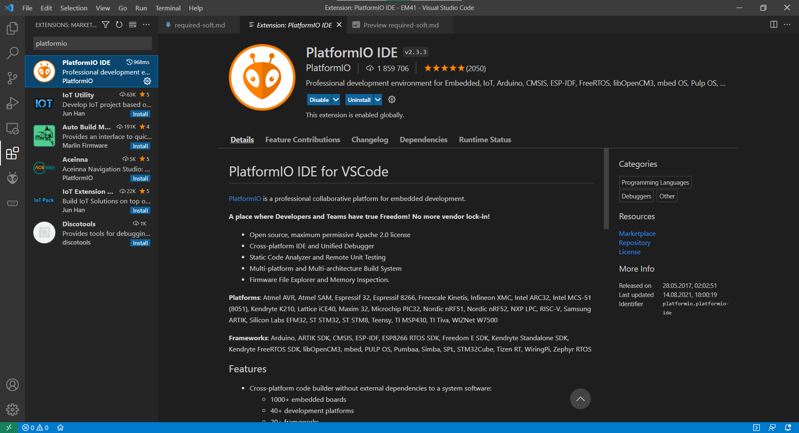
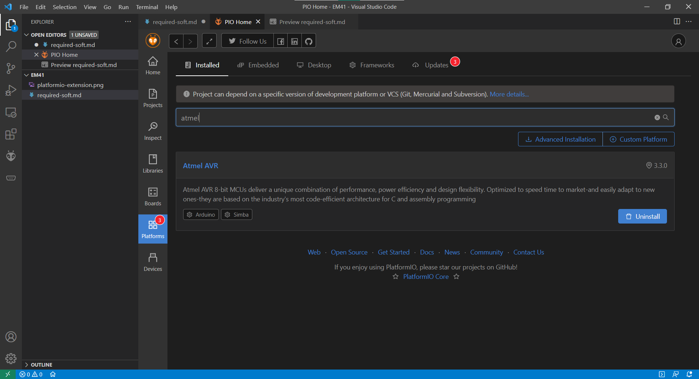

# Необходимое программное обеспечение для работы с лабораторным комплекcом Atmega32 (сенсорные устройства)

Для работы с лабораторным комплексом необходимы следующие программы:

* [Visual Studio Code](#установка-редактора-visual-studio-code)
* [Расширение PlatformIO](#установка-platformio-extensions)
* [Утилита AVRDUDE](#установка-утилиты-avrdude)
* [Система Git](#система-контроля-версий-git)

## Установка редактора Visual Studio Code

Visual Studio Code (VSCode) - кроссплатформенный редактор кода с возможностью кастомизации и расширения, в частности, под разработку ПО для микроконтроллреров. В нашем случае это МК ATMega32, с помощью которого осуществляется работы с сенсорами и сенсорными устройствами.

Visual Studio Code можно установить с [сайта](https://code.visualstudio.com), скачав установщик и проделав все стандартные процедуры установки.

Теперь нам доступен модный и стильный редактор кода, в котором мы продолжим свою работы.

---

## Установка PlatformIO extensions

PlatformIO - экосистема для разработки ПО для встраиваемых систем. Включается в себя систему сборки под множество платформ и архитектур. С помощью PlatformIO мы будем собирать и загружать код в МК ATMega32.

Из VSCode PlatformIO доступно в виде расширения, которое можно [установить](https://platformio.org/install/ide?install=vscode) внутри VSCode:

Вместе с собой это расширение поставить ещё вспомогательное - не мешать ему в этом!

После установки расширения PlatformIO переходим на домашнюю страницу расширения чтобы установить поддержку платформы Atmel AVR:

Всё, теперь можно создавать и редактировать код для лабораторных работ.

---

## Установка утилиты AVRDUDE

AVRDUDE - утилита для загрузки/считывания/редактирования в память микроконтроллеров AVR. Нам эта утилита будет необходима для загрузки файла прошивки в память МК. 

Сквачиваем архив с программой со [страницы](http://download.savannah.gnu.org/releases/avrdude/) загрузки. Выбираем файл с названием `avrdude-6.3-mingw32.zip`. Затем распаковываем этот файл куда-нибудь в диск в отдельную папку. Затем (**обязательный этап!**) добавить путь к папке с расположением программы в системную переменную PATH.

---

## Система контроля версий Git

Git - это распределённая система контроля версия, предназначена для сопровождения проекта, облегчая работы с изменяющимися файлами. То есть, Git позволяет хранить в себе разные версии файлов проекта (**репозитория**) и при необходимости перемещаться между версиями, видеть изменения в файлах и многое другой. Git также работает с веб-сервисами (например Github), где удалённо хранятся репозитории.

Git понадобится для работы с репозиторием ы на Github, на котором размещены лабораторные работы. Установить Git [оффициального сайта](https://git-scm.com/downloads). Процесс установки можно подсмотреть [здесь](https://devpractice.ru/git-for-beginners-part-2-install-git/). 

Также будет полезно завести аккаунт на [Github](https://github.com).